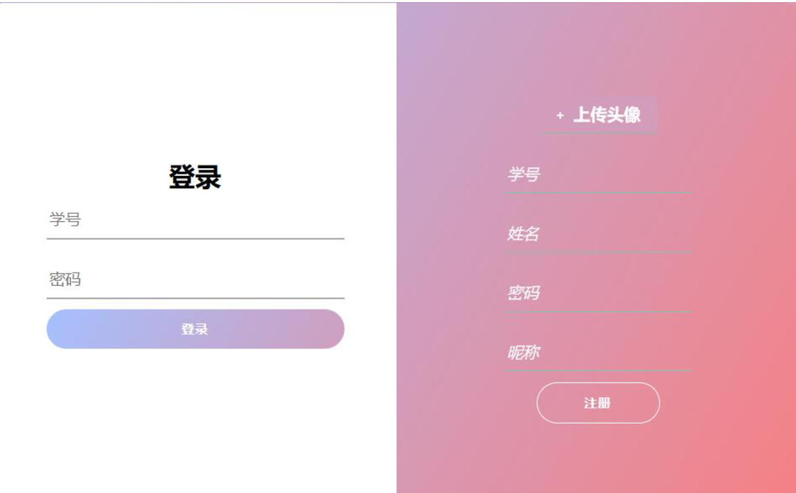
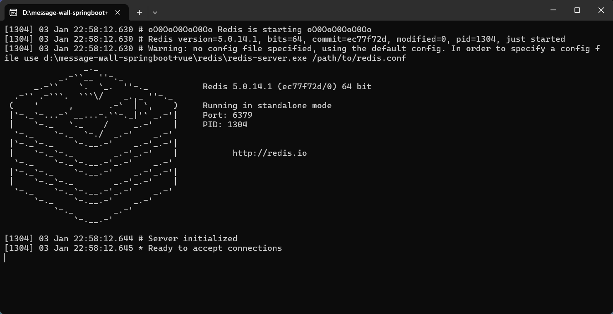
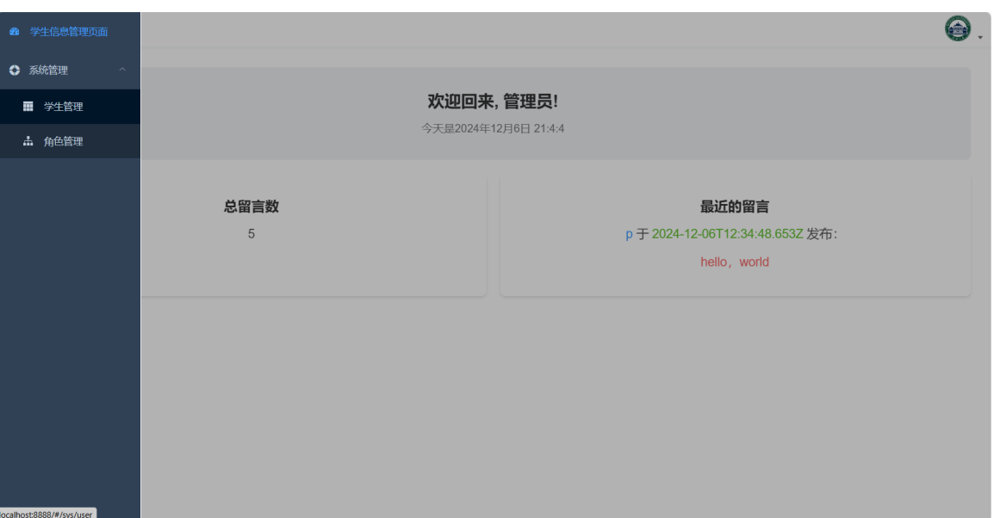
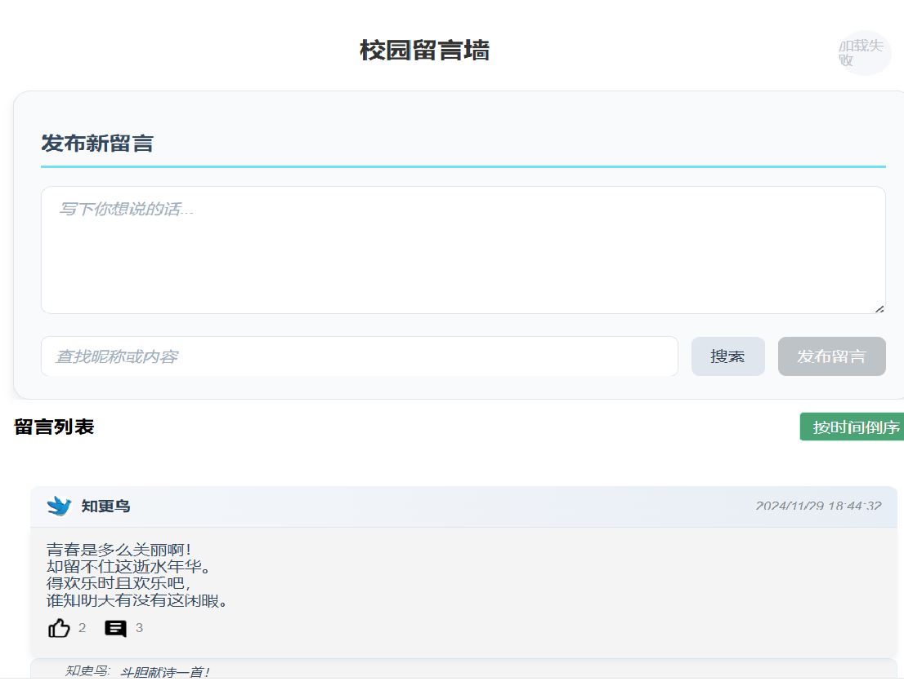
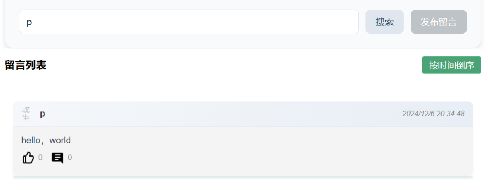

# 校园留言墙项目

这个项目是一个简单的“校园留言墙”系统，前端使用 Vue 2，后端使用 Spring Boot，MyBatis-Plus，Element，MySQL 和 Redis。

## 技术栈

- **前端**: Vue 2
- **后端**: Spring Boot
- **数据库**: MySQL
- **缓存**: Redis
- **ORM**: MyBatis-Plus
- **UI框架**: Element

## 在 Windows 上运行


下载项目
```bash
https://github.com/Elaina-9/message-wall-springboot-vue.git
```


### 1. 导入数据库

首先，需要在 MySQL 中创建一个数据库，并导入项目中提供的 SQL 文件。可以使用以下步骤：(此处可以使用命令行，不过可视化工具如navicat会更方便，我的MySQL登录root,密码123456)

1. 打开 MySQL 命令行工具，登录到你的 MySQL 数据库。
2. 创建一个名为test的数据库：

   ```bash
   CREATE DATABASE test;
   ```

   进入数据库并导入
   ```bash
   mysql -u root -p
   ```
   ```
   USE test;
   ```
   导入，test.sql已在项目里给出，注意路径
   ```bash
   source test.sql;
   ```


### 2. 启动前端

进入frontend目录，执行(npm的下载和配置略)
```bash
npm install
```
启动项目
```bash
npm run dev
```
按照提示打开浏览器，将看到


### 3.启动后端

使用IDEA导入backend项目，下载maven并修改IDEA配置，选择使用本地的maven，注意给maven添加镜像源，保证pom.xml文件不报错(如果报错代表有部分依赖下载失败)，这里给出我的镜像源配置，在conf/settings.xml

<details>
  <summary>mirrors配置</summary>

```bash
<mirrors>
    <!-- mirror
     | Specifies a repository mirror site to use instead of a given repository. The repository that
     | this mirror serves has an ID that matches the mirrorOf element of this mirror. IDs are used
     | for inheritance and direct lookup purposes, and must be unique across the set of mirrors.
     |
    <mirror>
      <id>mirrorId</id>
      <mirrorOf>repositoryId</mirrorOf>
      <name>Human Readable Name for this Mirror.</name>
      <url>http://my.repository.com/repo/path</url>
    </mirror>
     -->
     <mirror>
    <id>alimaven</id>
    <name>aliyun maven</name>
    <url>
        http://maven.aliyun.com/nexus/content/groups/public/
    </url>
    <mirrorOf>central</mirrorOf>        
</mirror>
 <mirror>
      <id>repo1</id>
      <mirrorOf>central</mirrorOf>
      <name>central repo</name>
      <url>http://repo1.maven.org/maven2/</url>
    </mirror>
    <mirror>
      <id>ibiblio</id>
      <mirrorOf>central</mirrorOf>
      <name>Human Readable Name for this Mirror.</name>
      <url>http://mirrors.ibiblio.org/pub/mirrors/maven2/</url>
    </mirror>

  </mirrors>
```

</details>  <br>
  
     
之后选择dminApplication.java并启动

### 4.启动redis
双击项目Redis文件夹下的redis-server.exe即可，效果如下


### 5.使用项目
此时即可正常使用项目，账号0密码123456是管理员账号，界面如下

诸如账号1，2，3，4等都是学生账号，密码也是123456，界面如下



上传头像的默认在D盘，即项目应该在D:\message-wall-springboot+vue，否则上传头像可能出问题，当然，直接去backend里改下路径也行


如果要在Linux上部署，可以执行
```bash
npm run build
```
会生成dist文件夹，使用nginx等服务器运行即可

后端使用
```bash
maven package
```
打包成jar,上传到服务器运行即可

一个问题是要处理跨域，这需要修改backend配置
浏览器只允许网页访问与自己同源的资源(addr:port一致)

例如你的前端在http://yourip:8888,现请求后端http://yourip:9999,由于开始时浏览器显示的网页是http://yourip:8888,即你的ORIGIN字段是yourip:8888,只有在后端设置允许源为yourip:8888的域访问后端(port:9999)，才能正常访问